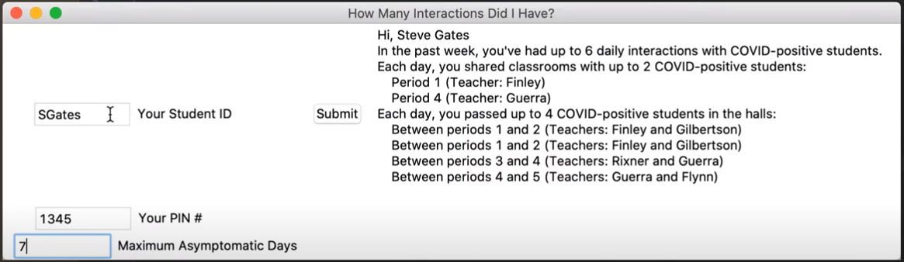

# SchoolTrace (Rice COVID-19 Design-a-Thon Grand Prize winner)
**Python app for automated, app-less contact tracing in schools** (view our slides [here](https://github.com/nglaze00/SchoolTrace/blob/master/SchoolTrace_presentation.pdf), and a recording of our presentation [here](https://drive.google.com/file/d/1oAxDUcJFzZCAccyVOJ-XIpJvPaL3_XX7/view?usp=sharing))

* Leverages student / faculty schedules to perform contact tracing based on possible interactions in school classrooms and hallways
* By representing each school's floor plan as a graph, possible interactions in hallways can be accounted for, enabling more comprehensive risk notification (for parents / students) and analysis (for school administrations)
* Created using **Python** (Pandas, tkinter, networkx)

**App POC:**

